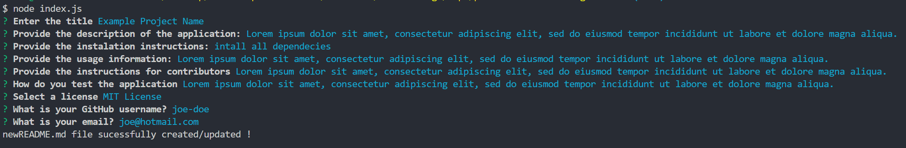
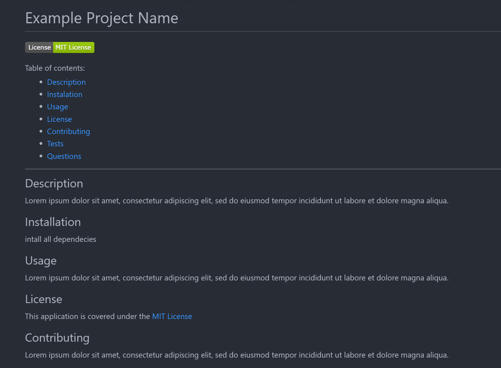

# Professional README generator
  

  #### Table of contents:
  - [Description](#description)
  - [Instalation](#installation)
  - [Usage](#usage)
  - [License](#license)
  - [Contributing](#contributing)
  - [Tests](#tests)
  ---
  ## Description
  This Node.js application generates a markdown README file using the answers to command line prompt questions.  
  - Link to video walk-through: https://drive.google.com/file/d/185O7fGr9mY-OejfP6FRLZeM3OEw3tE1k/view

  ## Installation
  Install inquirer version 8.2.4 and add it to the list of dependencies by running `npm i inquirer@8.2.4`

  ## Usage
  Run `node index.js` in a command terminal

  ## License
  This application is covered under the [MIT License](LICENSE)

  ## Contributing

  Lorem ipsum dolor sit amet, consectetur adipiscing elit, sed do eiusmod tempor incididunt ut labore et dolore magna aliqua.

  ## Tests
  Simply start the application and follow the prompts

---

---

---

